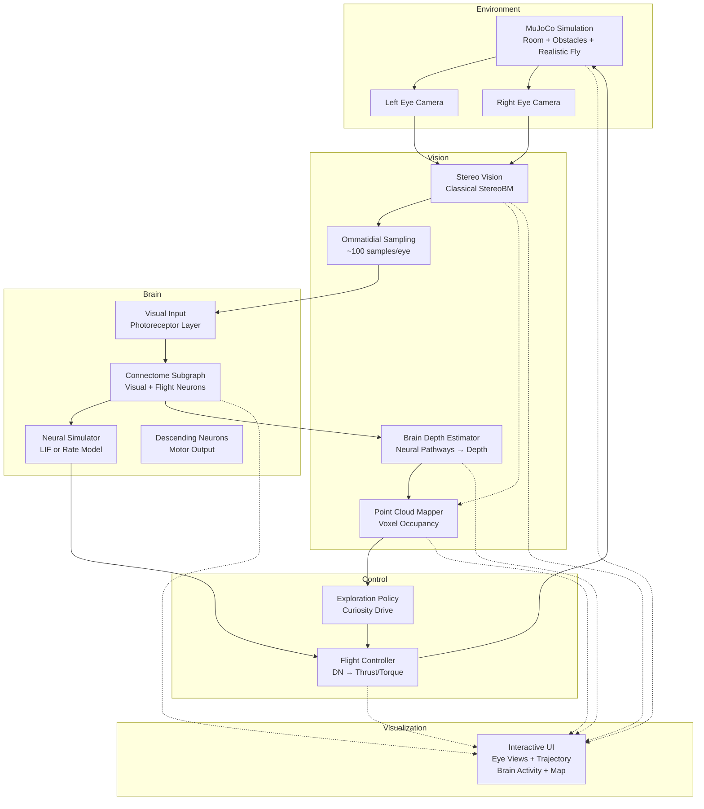

# 3dfly

**Fruit fly connectome-driven 3D exploration and mapping**

A research simulator where a male fruit fly's brain, structured by the real [MaleCNS v1.0 connectome](https://male-cns.janelia.org/), controls flight in a MuJoCo physics environment while building a 3D point cloud map of its surroundings through stereo vision.

[](https://opensource.org/licenses/MIT)
[](https://www.python.org/downloads/)

---

## Overview

**3dfly** demonstrates exploratory behavior driven by a biologically-inspired neural architecture. The system:

- **Brain**: Uses the MaleCNS v1.0 connectome (male *Drosophila* CNS, ~166,700 neurons) as the neural wiring diagram. **NEW**: Can now run with the full brain (~185k neurons with connections) using sparse matrix operations.
- **Vision**: Dual cameras provide stereo views; **motion parallax and optic flow** (real fly depth cues) processed through connectome
- **Motor**: Descending neuron activity maps to flight thrust and torques in a MuJoCo simulation
- **Depth Perception**: **Brain-based motion parallax** (primary) — optical flow + egomotion routed through connectome → spatial depth map at 12×16 resolution
    - **Comparison baseline**: Classical StereoBM stereo provides dense depth for validation
- **Exploration**: Biases flight toward under-mapped regions using occupancy-based curiosity
- **Soft Collision Recovery**: Automatically recovers from wall/obstacle hits to continue exploration

**Important scientific note**: This is a *connectome-structured simulator* with engineered I/O mapping, not a claim of neuron-for-neuron biological accuracy. The brain dynamics use simplified LIF/rate models applied to the synaptic graph. **NEW**: Depth estimation now uses **motion parallax and optic flow** (the primary depth cues real fruit flies use) instead of arbitrary mid-network readouts. Optical flow is computed from consecutive frames, combined with flight velocity (egomotion), routed through the connectome (set_input → simulate → readout), and decoded from visual neuron population activity into a 12×16 spatial depth map. This approach is biologically motivated but the flow extraction, parallax calculation, and neural readout are hand-designed engineering approximations, not biologically validated.

---

## Features

- **Realistic Fly Model**: Uses anatomically-detailed 3D meshes from the [flybody project](https://github.com/TuragaLab/flybody) (Google DeepMind & HHMI Janelia)
- **Biologically-Inspired Brain**: MaleCNS v1.0 connectome structure with ~166,700 neurons. **NEW**: Can run with full brain (~185k neurons with connections) using sparse matrices.
- **Brain-Based Motion Parallax**: Depth via optic flow + egomotion routed through connectome (real Drosophila depth cue, 12×16 resolution)
- **Stereo Vision**: Dual cameras (160×120) with classical StereoBM depth (dense comparison baseline) and ommatidial sampling
- **Interactive 3D Visualization**: Real-time god's-eye view with orbit/pan/zoom controls
- **Live Point Cloud Mapping**: Brain-estimated 3D map accumulates and renders in real-time on the same interactive web page
- **Curiosity-Driven Exploration**: Biases flight toward under-mapped regions
- **Soft Collision Recovery**: Automatically backs off and reorients after hitting obstacles, enabling continuous exploration instead of stopping on first collision

## Architecture



---

## Installation

### Requirements

- Python 3.9+
- Linux or macOS (Windows may work but not tested)

### Install

```bash
# Clone repository
git clone https://github.com/liudicsu/3dfly.git
cd 3dfly

# Install package with development dependencies
pip install -e ".[dev]"
```

---

## Quick Start

### Option 1: Interactive Unified Web Interface (Recommended)

**🎮 Single-page web interface with 3D god's-eye view + dashboard panels**

```bash
# Create small demo subgraph (500 neurons, synthetic)
python scripts/create_demo_subgraph.py

# Run interactive demo
threedfly run-interactive --subgraph data/demo_subgraph.npz --steps 5000

# Open your browser to http://localhost:8080
# Everything is in one page: 3D view + all dashboard panels
```

**Interactive features:**
- **3D god's-eye view**: See the fly, trajectory, and **live updating brain-depth point cloud** together with orbit/pan/zoom
- **Real-time point cloud rendering**: The brain-estimated 3D map accumulates and updates live in the same view as the fly moves
- **Dashboard panels in same page**: Left/right eye views, trajectory plot, brain activity, flight commands, system status
- **Playback controls**: Play, pause, step frame-by-frame, or reset
- **Adjustable speed**: Control simulation playback speed

**One browser tab, everything together** — no separate matplotlib windows! The brain-based point cloud builds up in real-time as the fly explores. Classical StereoBM depth is also computed as a comparison baseline.

### Option 2: Run with Static Visualization

```bash
# Create small demo subgraph (500 neurons, synthetic)
python scripts/create_demo_subgraph.py

# Run demo with matplotlib plots
threedfly run --subgraph data/demo_subgraph.npz --steps 1000 --viz-mode matplotlib

# Advanced: Configure collision recovery
threedfly run --subgraph data/demo_subgraph.npz --steps 2000 --max-collisions 50
```

### Option 3: Download Full Connectome and Extract Subgraph

**Warning**: Downloads ~1.1 GB of data.

```bash
# Download MaleCNS v1.0 data
threedfly download

# Extract visual-flight subgraph (may take a few minutes)
threedfly extract --output data/subgraph.npz

# Run with extracted subgraph (interactive)
threedfly run-interactive --subgraph data/subgraph.npz --steps 5000

# Or run with static visualization
threedfly run --subgraph data/subgraph.npz --steps 2000
```

### Option 4: Build and Run with Full MaleCNS Connectome

**NEW**: Run the simulation using the complete male fruit fly brain (~185k neurons, ~10M connections).

```bash
# Download MaleCNS v1.0 data (~1.1 GB)
threedfly download

# Build full-brain connectome (~185k neurons, optimized for memory efficiency)
# Default min-synapses=3 filters weak connections (biologically significant synapses only)
# Takes ~1-2 minutes, produces ~35 MB file
threedfly build-full --output data/full_connectome.npz

# Run with full brain (interactive)
threedfly run-interactive --subgraph data/full_connectome.npz --steps 5000

# Or run with static visualization
threedfly run --subgraph data/full_connectome.npz --steps 2000
```

**Full-brain parameters:**
- **Neurons**: ~185k annotated neurons with connections (min-synapses=3)
- **Connections**: ~10.6M synapses (filtered from 150M raw connections)
- **Memory**: ~4-8GB RAM during build, final file ~35MB
- **Runtime**: Sparse matrix operations scale well; expect real-time or near-real-time with RateSimulator

**Note**: The default `--min-synapses 3` filter keeps biologically significant connections while dramatically reducing memory usage. For the complete unfiltered connectome (~150M connections), use `--min-synapses 1` (requires more memory and produces a larger file).

### Headless Mode (for CI/servers)

```bash
threedfly run --subgraph data/demo_subgraph.npz --steps 1500 --headless --save-output output/
# Outputs: 
#   output/point_cloud_brain.ply (primary: brain-depth reconstruction)
#   output/point_cloud_stereo.ply (comparison: classical StereoBM, dense sampling)
#   output/final_state.png (visualization snapshot)
# Both point clouds exported at 1cm voxel resolution for detailed comparison
```

---

## Usage

### CLI Commands

#### `threedfly download`
Download MaleCNS v1.0 connectome data from Google Cloud Storage.

```bash
threedfly download [--output-dir DIR] [--files annotations,weights]
```

#### `threedfly extract`
Extract visual-flight subgraph from full connectome.

```bash
threedfly extract [--data-dir DIR] [--output subgraph.npz] [--max-neurons N]

# Create small demo subgraph
threedfly extract --demo
```

#### `threedfly build-full`
**NEW**: Build full-brain connectome with all neurons.

```bash
threedfly build-full [--data-dir DIR] [--output full_connectome.npz] [--min-synapses N]

# Build with default filtering (recommended)
threedfly build-full

# Build with stricter filtering (fewer connections, less memory)
threedfly build-full --min-synapses 5

# Build unfiltered (all 150M connections, requires more memory)
threedfly build-full --min-synapses 1
```

Creates a sparse adjacency matrix for the entire MaleCNS v1.0 connectome (~130k-185k neurons depending on filtering). The `--min-synapses` parameter filters weak connections:
- `min-synapses=3` (default): ~185k neurons, ~10M connections, ~35MB file, 4-8GB RAM
- `min-synapses=5`: ~165k neurons, ~6M connections, ~25MB file, 3-5GB RAM
- `min-synapses=1`: ~185k neurons, ~50M+ connections, ~200MB+ file, 10-15GB RAM

#### `threedfly run`
Run the simulation with static visualization.

```bash
threedfly run [OPTIONS]

Options:
  --subgraph PATH              Path to subgraph file [default: data/demo_subgraph.npz]
  --steps N                    Simulation steps [default: 2000]
  --viz-mode MODE              matplotlib|open3d|both|none [default: matplotlib]
  --headless                   Run without visualization
  --save-output DIR            Output directory [default: output]
  --simulator-type TYPE        rate|lif [default: rate]
  --seed N                     Random seed [default: 42]
```

#### `threedfly run-interactive`
Run the simulation with unified interactive web interface.

```bash
threedfly run-interactive [OPTIONS]

Options:
  --subgraph PATH              Path to subgraph file [default: data/demo_subgraph.npz]
  --steps N                    Maximum simulation steps [default: 5000]
  --save-output DIR            Output directory [default: output]
  --simulator-type TYPE        rate|lif [default: rate]
  --seed N                     Random seed [default: 42]
  --host HOST                  Visualization server host [default: 0.0.0.0]
  --port PORT                  Visualization server port [default: 8080]

Features:
  - Single-page web interface combining 3D view and dashboard panels
  - Interactive 3D view with orbit/pan/zoom
  - Dashboard: stereo views, trajectory, brain activity, flight commands, status
  - Play/pause/step/reset controls
  - Adjustable playback speed

After starting, open your browser to http://localhost:8080
All visualizations are in one page — no separate windows!
```

#### `threedfly demo`
Quick demo (automatically handles data setup).

```bash
threedfly demo
```

### Python API

```python
from threedfly import ConnectomeLoader, BrainSimulator, FlyEnvironment
from threedfly.runner import run_simulation

# Run complete simulation
run_simulation(
    subgraph_path="data/demo_subgraph.npz",
    n_steps=2000,
    viz_mode="matplotlib",
    save_output_dir="output",
    simulator_type="rate",
    seed=42
)
```

---

## Data

### MaleCNS v1.0 Connectome

Source: **Male Central Nervous System (MaleCNS) v1.0**  
- Project: https://male-cns.janelia.org/  
- Publication: https://research.google/blog/a-connectomics-milestone-mapping-the-complete-male-fruit-fly-brain/  
- Neurons: ~166,700 (full CNS)  
- Synapses: ~109 million  
- License: **CC-BY 4.0** (must cite)

**Data files**:
- Body annotations: `body-annotations-male-cns-v1.0-minconf-0.5.feather` (~14 MB)
- Connectome weights: `connectome-weights-male-cns-v1.0-minconf-0.5.feather` (~1.1 GB)

**Citation**:
```
Dorkenwald et al. (2024). Male Central Nervous System Connectome v1.0.
https://male-cns.janelia.org/
```

### Subgraph Extraction

The full connectome is too large for realtime simulation. We provide two options:

**Option 1: Visual-Flight Subgraph (default)**

Extract a targeted subgraph focusing on:

- **Visual system**: Photoreceptors (R1-R8), lamina (L1-L5), medulla (Mi, Tm, T4, T5), lobula complex (LC, LPLC), lobula plate (LPi)
- **Descending neurons**: Motor control pathways (DN, DNa, DNb, DNp)
- **Central complex**: Navigation circuits (fan-shaped body, ellipsoid body, protocerebral bridge)

Filtering is based on neuron type annotations. If type-based filtering yields insufficient neurons, neuropil region-based selection is used.

**Option 2: Full-Brain Connectome (NEW)**

Use the complete MaleCNS connectome with all annotated neurons (~130k-185k neurons depending on filtering). Sparse matrix operations make this feasible for real-time or near-real-time simulation with the RateSimulator. Memory-efficient filtering (`min-synapses=3` by default) reduces the dataset from 150M to ~10M connections while keeping biologically significant synapses.

---

## Testing

```bash
# Run all tests
pytest

# Run with coverage
pytest --cov=threedfly --cov-report=html

# Run specific test modules
pytest tests/test_connectome.py -v
pytest tests/test_vision.py -v
pytest tests/test_control.py -v
```

---

## Project Structure

```
threedfly/
├── connectome/         # Connectome loading, subgraph extraction, neural simulation
│   ├── downloader.py   # Download MaleCNS data
│   ├── loader.py       # Load and extract subgraph
│   └── simulator.py    # LIF and rate-based simulators
├── vision/             # Vision processing and depth estimation
│   ├── stereo.py       # Classical StereoBM (comparison baseline)
│   ├── brain_depth.py  # Brain-based depth estimation (primary)
│   └── pointcloud.py   # 3D map accumulation, occupancy tracking
├── sim/                # MuJoCo physics simulation
│   ├── mjcf.py         # MJCF (XML) model definitions
│   └── environment.py  # Fly environment with stereo cameras
├── control/            # Flight control and exploration
│   ├── controller.py   # Brain activity → motor commands
│   └── exploration.py  # Curiosity-driven policy
├── viz/                # Interactive visualization
│   └── visualizer.py   # Real-time plots (matplotlib/Open3D)
├── cli.py              # Command-line interface
└── runner.py           # Main simulation loop

data/                   # Connectome data and subgraphs (gitignored except demo)
scripts/                # Utilities (demo subgraph generation)
tests/                  # Unit tests
```

---

## Configuration

### Neural Simulator Parameters

**LIF Model** (`BrainSimulator`):
- `dt`: 1ms timestep
- `tau`: 10ms membrane time constant
- `v_thresh`: 1.0 spike threshold
- `refrac_period`: 2ms refractory period

**Rate Model** (`RateSimulator`):
- `dt`: 10ms timestep
- `tau`: 50ms time constant
- `activation`: ReLU (default) | sigmoid | tanh

**Recommendation**: Use rate model for faster realtime simulation. LIF for more detailed spike dynamics (slower).

### Brain-Based Depth Estimation (Motion Parallax)

**NEW**: The `BrainDepthEstimator` now uses **motion parallax and optic flow** — the primary depth cues used by real fruit flies — instead of arbitrary neural readouts:

1. **Optical flow computation**: Dense flow between consecutive frames using Farneback method
2. **Motion parallax**: Depth = (velocity × focal_length) / flow_magnitude
   - Nearer objects move faster on retina during self-motion
   - Uses flight velocity (egomotion) from MuJoCo physics
3. **Brain routing**: Flow features → connectome (set_input → simulate → readout)
4. **Spatial depth map**: Population readout from visual neurons → 12×16 depth grid
5. **Higher resolution**: 192 cells (12×16) vs old 48 cells (8×6) = **4× spatial resolution**

**Biological motivation**:
- ✅ Real Drosophila primarily use motion parallax/optic flow, NOT stereo disparity
- ✅ Looming (expansion) for collision detection (already present)
- ✅ T4/T5 neurons (motion), lobula plate (optic flow) are key biological pathways
- ⚙️ Flow extraction and depth calculation are hand-designed engineering
- ⚙️ Neural readout mapping is inspired by, but not validated against, fly neuroscience

**vs Old approach**: Previous implementation used arbitrary mid-network neurons (35-65% range) with hand-designed 8×6 readout producing blurry depth. New approach follows real fly depth perception mechanisms.

### StereoBM Comparison Baseline

Classical stereo block matching provides a dense comparison baseline:
- **High resolution**: 160×120 eye cameras for detailed stereo matching
- **Dense sampling**: Stereo depth computed every 2 steps
- **Low confidence threshold**: 0.08 minimum confidence for informative comparison (typical confidences 0.1–0.4)
- **Tuned parameters**: 64 disparities, block size 5, optimized for fly-scale depth range
- **Typical output**: ~200K raw points → thousands of unique points @1-3cm voxel resolution on a 1500-step run

### Flight Control Mapping

The `FlightController` uses a simple hand-designed linear mapping:
- **Thrust forward**: Baseline (0.6) + Mean DN activity (strong forward bias for room traversal)
- **Thrust up**: No bias + Minimal DN activity (reduced to eliminate ceiling bouncing)
- **Yaw**: Left-right DN asymmetry (strong turning for horizontal exploration)
- **Pitch/Roll**: Front-back DN asymmetry (reduced to minimize vertical oscillation)

**Horizontal exploration priority**: Controller gains and baselines are tuned to strongly favor horizontal (XY) room coverage over vertical bobbing. Forward thrust has a high baseline (0.6) and gain (1.0), while upward thrust has zero bias and minimal gain (0.05). Yaw gain is high (0.8) to encourage turning and room traversal.

This mapping is **engineered, not biologically validated**. It provides plausible control but does not claim to replicate actual fly motor control.

### Brain-Mediated Obstacle Avoidance

**How the fly avoids obstacles:**

1. **Visual features → Brain input**:
   - Ommatidial intensity samples (left/right eyes, ~100 samples each)
   - **Looming/proximity signals** (8 directional sectors): Engineered visual features computed from stereo depth map, indicating obstacle proximity in each direction (forward, forward-left, left, back-left, back, back-right, right, forward-right)
   - These 208 features (200 ommatidial + 8 looming) are concatenated and fed as input to the connectome

2. **Brain processing**:
   - Input flows through the MaleCNS connectome subgraph (visual neurons → descending neurons)
   - Neural dynamics (LIF or rate model) propagate activity through actual synaptic connections
   - The brain's response to looming signals emerges from connectome structure + dynamics

3. **Motor output → Steering away**:
   - Descending neuron (DN) activity is read out by the flight controller
   - DN asymmetry generates yaw/pitch/roll to steer away from obstacles
   - The motor response is **brain-mediated**: looming features → connectome activity → DN output → motor commands

**What's brain-controlled vs engineered:**
- ✅ **Brain-controlled**: The transformation from visual input (ommatidia + looming) to motor output (DN activity) routes through the real connectome structure with neural dynamics
- ⚙️ **Engineered**: 
  - Looming feature extraction (inverse depth by sector from StereoBM)
  - Input mapping (which neurons receive looming signals)
  - DN-to-motor readout (linear mapping from DN activity to thrust/torque)
  - Soft collision recovery (physics script as last-resort safety net, NOT primary avoidance)

**Honest assessment**: The fly steers based on brain activity that is influenced by obstacle proximity signals routed through the connectome. This is brain-structured avoidance with engineered feature extraction and motor readout, not a claim that fruit flies use exactly these visual features or that our DN readout matches biological motor control. The primary avoidance mechanism operates through the brain pathway; soft collision recovery serves only as a safety fallback.

### Exploration Policy

- Samples exploration score in 8 directions around current position (horizontal plane only)
- Scores based on voxel occupancy (low occupancy → high score)
- Biases flight toward frontiers with strong forward signal (1.5) and turning
- **No vertical exploration bias**: Altitude control delegated to brain/controller to avoid ceiling bouncing
- Random exploration with probability 0.2

### Collision Recovery

- **Soft recovery** automatically handles collisions instead of stopping
- Backs off from collision point, dampens velocity, randomizes orientation
- Configurable max collisions (default: 50 non-interactive, 100 interactive)
- Enables continuous exploration: 1500+ steps vs ~255 without recovery
- See [COLLISION_RECOVERY.md](COLLISION_RECOVERY.md) for details

---

## Troubleshooting

### ModuleNotFoundError: mujoco

```bash
pip install mujoco>=3.0.0
```

### OpenCV or Open3D installation issues

```bash
# Ubuntu/Debian
sudo apt-get install -y python3-opencv libgl1-mesa-glx

# macOS
brew install open3d
pip install opencv-python open3d
```

### Visualization window not showing

- Ensure you're not in headless mode
- Check `DISPLAY` environment variable (Linux)
- Try `--viz-mode matplotlib` instead of `open3d`

### Out of memory during subgraph extraction

```bash
# Limit number of neurons
threedfly extract --max-neurons 5000
```

---

## Contributing

Contributions welcome! Please:

1. Fork the repository
2. Create a feature branch
3. Write tests for new functionality
4. Ensure all tests pass: `pytest`
5. Format code: `black threedfly/ tests/`
6. Submit a pull request

---

## License

**Code**: MIT License (see [LICENSE](LICENSE))  
**Connectome Data**: CC-BY 4.0 (cite male-cns.janelia.org)

---

## Citation

If you use this project in research, please cite:

```bibtex
@software{threedfly2024,
  title={3dfly: Connectome-Driven 3D Exploration},
  author={3dfly contributors},
  year={2024},
  url={https://github.com/liudicsu/3dfly}
}
```

And cite the MaleCNS connectome:

```bibtex
@misc{malecns2024,
  title={Male Central Nervous System Connectome v1.0},
  author={Dorkenwald, Sven and others},
  year={2024},
  url={https://male-cns.janelia.org/}
}
```

---

## Acknowledgments

- **Google Research** and **HHMI Janelia Research Campus** for the MaleCNS v1.0 connectome
- **Google DeepMind** and **HHMI Janelia** for the flybody anatomical meshes (Apache-2.0 license)
- **MuJoCo** physics engine (DeepMind)
- **Open3D** library
- The fruit fly research community

---

## 中文说明

**3dfly** 是一个果蝇脑驱动的3D探索模拟器。

### 主要特点

- **写实的果蝇模型**：使用来自 [flybody 项目](https://github.com/TuragaLab/flybody)（Google DeepMind & HHMI Janelia）的解剖学精确3D网格
- 使用真实的雄性果蝇中枢神经系统连接组（MaleCNS v1.0，约16.67万个神经元）。**新功能**：现可使用完整大脑运行（约18.5万个有连接的神经元）通过稀疏矩阵操作。
- **大脑驱动的运动视差深度感知**：使用光流+自我运动通过连接组处理（真实果蝇深度感知机制，12×16分辨率）
- 双目视觉深度估计（经典StereoBM作为对比基准）和3D点云建图
- MuJoCo物理仿真环境
- 基于好奇心的探索策略
- **交互式3D上帝视角可视化**

### 快速开始

#### 方式一：交互式统一网页界面（推荐）

```bash
# 安装
pip install -e ".[dev]"

# 创建演示子图
python scripts/create_demo_subgraph.py

# 运行交互式模拟
threedfly run-interactive --subgraph data/demo_subgraph.npz --steps 5000

# 在浏览器中打开 http://localhost:8080
# 所有内容在同一页面：3D视图 + 仪表盘面板
```

**交互功能：**
- **3D上帝视角**：同时看到果蝇、飞行轨迹和**实时更新的大脑深度点云地图**，支持旋转、平移和缩放
- **实时点云渲染**：大脑估计的3D地图随着果蝇移动在同一视图中实时累积和更新
- **仪表盘面板**（同页面）：左右眼视图、飞行轨迹图、大脑活动、飞行指令、系统状态
- **播放控制**：播放、暂停、单步前进、重置模拟
- **速度调节**：控制模拟播放速度

**一个浏览器标签页，所有功能齐全** — 不再需要单独的matplotlib窗口！大脑驱动的点云在果蝇探索时实时构建。经典StereoBM深度同时作为对比基准计算。

#### 方式二：静态可视化

```bash
# 运行模拟（静态matplotlib图表）
threedfly run --subgraph data/demo_subgraph.npz --steps 1000
```

#### 方式三：使用完整大脑连接组（新功能）

```bash
# 下载MaleCNS v1.0数据（约1.1 GB）
threedfly download

# 构建完整大脑连接组（约18.5万个神经元，内存优化）
# 默认min-synapses=3过滤弱连接（仅保留生物学显著突触）
# 耗时约1-2分钟，生成约35 MB文件
threedfly build-full --output data/full_connectome.npz

# 使用完整大脑运行（交互式）
threedfly run-interactive --subgraph data/full_connectome.npz --steps 5000
```

**完整大脑参数：**
- **神经元**：约18.5万个有连接的注释神经元（min-synapses=3）
- **连接**：约1060万个突触（从1.5亿原始连接中过滤）
- **内存**：构建时约4-8GB RAM，最终文件约35MB
- **运行时间**：稀疏矩阵操作扩展性好；使用RateSimulator可达实时或接近实时

### 重要说明

这是一个**基于连接组结构的模拟器**，使用简化的神经元模型（LIF或速率模型）和工程化的输入输出映射。**新版本**：深度估计现在使用**运动视差和光流**（真实果蝇使用的主要深度线索），而不是任意的中间网络神经元读取。从连续帧计算光流，结合飞行速度（自我运动），通过连接组路由（set_input → simulate → readout），从视觉神经元群体活动解码为12×16空间深度图。这种方法有生物学动机，但光流提取、视差计算和神经读取是手工设计的工程近似，未经生物学验证。

---

**Happy exploring! 🪰**
