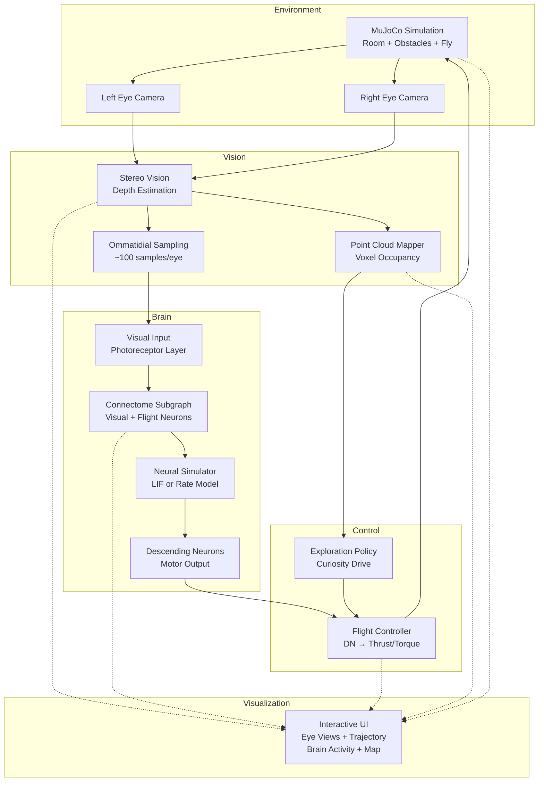

# 3dfly

**Fruit fly connectome-driven 3D exploration and mapping**

A research simulator where a male fruit fly's brain, structured by the real [MaleCNS v1.0 connectome](https://male-cns.janelia.org/), controls flight in a MuJoCo physics environment while building a 3D point cloud map of its surroundings through stereo vision.

[](https://opensource.org/licenses/MIT)
[](https://www.python.org/downloads/)

---

## Overview

**3dfly** demonstrates exploratory behavior driven by a biologically-inspired neural architecture. The system:

- **Brain**: Uses the MaleCNS v1.0 connectome (male *Drosophila* CNS, ~166,700 neurons) as the neural wiring diagram
- **Vision**: Dual cameras provide stereo views, processed to estimate depth and sample visual features
- **Motor**: Descending neuron activity maps to flight thrust and torques in a MuJoCo simulation
- **Mapping**: Accumulates stereo depth into a global 3D point cloud
- **Exploration**: Biases flight toward under-mapped regions using occupancy-based curiosity
- **Interactive Web UI**: Real-time browser-based visualization with interactive 3D point cloud exploration

**Important scientific note**: This is a *connectome-structured simulator* with engineered I/O mapping, not a claim of neuron-for-neuron biological accuracy. The brain dynamics use simplified LIF/rate models applied to the synaptic graph. The mapping from visual input to photoreceptor activity and from descending neurons to motor commands is hand-designed, not learned or biologically validated.

---

## Architecture



---

## Installation

### Requirements

- Python 3.9+
- Linux or macOS (Windows may work but not tested)

### Install

```bash
# Clone repository
git clone https://github.com/liudicsu/3dfly.git
cd 3dfly

# Install package with development dependencies
pip install -e ".[dev]"
```

---

## Quick Start

### Option 1: Interactive Web UI (Recommended)

The web UI provides a fully interactive 3D experience with real-time visualization and controls.

```bash
# Create small demo subgraph (500 neurons, synthetic)
python scripts/create_demo_subgraph.py

# Launch interactive web UI
threedfly serve --subgraph data/demo_subgraph.npz --steps 2000

# Open your browser to http://127.0.0.1:8050
```

**Web UI Features**:
- 🎮 **Interactive 3D point cloud** - Orbit, zoom, pan to explore the reconstructed map
- 👀 **Live stereo vision** - Real-time left/right eye views
- 🧠 **Brain activity** - Visualize neural activity across the connectome
- ✈️ **Flight commands** - See thrust, yaw, pitch, roll in real-time
- 📊 **System stats** - Fly pose, trajectory, map statistics
- ⏯️ **Playback controls** - Play, pause, speed adjustment

### Option 2: Run with Static Visualizations

```bash
# Create small demo subgraph (500 neurons, synthetic)
python scripts/create_demo_subgraph.py

# Run demo with matplotlib
threedfly run --subgraph data/demo_subgraph.npz --steps 1000 --viz-mode matplotlib
```

### Option 3: Download Full Connectome and Extract Subgraph

**Warning**: Downloads ~1.1 GB of data.

```bash
# Download MaleCNS v1.0 data
threedfly download

# Extract visual-flight subgraph (may take a few minutes)
threedfly extract --output data/subgraph.npz

# Run with extracted subgraph
threedfly run --subgraph data/subgraph.npz --steps 2000
```

### Headless Mode (for CI/servers)

```bash
threedfly run --subgraph data/demo_subgraph.npz --steps 500 --headless --save-output output/
# Outputs: output/point_cloud.ply, output/final_state.png
```

---

## Usage

### CLI Commands

#### `threedfly serve` (Interactive Web UI)
Launch the interactive web interface (recommended).

```bash
threedfly serve [OPTIONS]

Options:
  --subgraph PATH              Path to subgraph file [default: data/demo_subgraph.npz]
  --steps N                    Simulation steps [default: 2000]
  --simulator-type TYPE        rate|lif [default: rate]
  --seed N                     Random seed [default: 42]
  --host ADDR                  Host address [default: 127.0.0.1]
  --port N                     Port number [default: 8050]

# Example: Custom port and more steps
threedfly serve --port 8888 --steps 5000
```

The web UI will open at `http://127.0.0.1:8050` (or your custom port). Use your browser to:
- Interact with the 3D point cloud (click and drag to orbit)
- Play/pause the simulation
- Adjust simulation speed
- View real-time stereo camera feeds
- Monitor brain activity and flight commands

#### `threedfly download`
Download MaleCNS v1.0 connectome data from Google Cloud Storage.

```bash
threedfly download [--output-dir DIR] [--files annotations,weights]
```

#### `threedfly extract`
Extract visual-flight subgraph from full connectome.

```bash
threedfly extract [--data-dir DIR] [--output subgraph.npz] [--max-neurons N]

# Create small demo subgraph
threedfly extract --demo
```

#### `threedfly run`
Run the simulation with various visualization modes.

```bash
threedfly run [OPTIONS]

Options:
  --subgraph PATH              Path to subgraph file [default: data/demo_subgraph.npz]
  --steps N                    Simulation steps [default: 2000]
  --viz-mode MODE              matplotlib|open3d|both|web|none [default: matplotlib]
  --headless                   Run without visualization
  --save-output DIR            Output directory [default: output]
  --simulator-type TYPE        rate|lif [default: rate]
  --seed N                     Random seed [default: 42]
  --web-host ADDR              Host for web UI (when viz-mode=web)
  --web-port N                 Port for web UI (when viz-mode=web)

# Examples:
# Run with web UI (same as 'threedfly serve')
threedfly run --viz-mode web --steps 2000

# Run with matplotlib
threedfly run --viz-mode matplotlib --steps 1000

# Run headless (for CI/servers)
threedfly run --headless --steps 500 --save-output output/
```

#### `threedfly demo`
Quick demo (automatically handles data setup).

```bash
threedfly demo
```

### Python API

```python
from threedfly import ConnectomeLoader, BrainSimulator, FlyEnvironment
from threedfly.runner import run_simulation

# Run complete simulation with web UI
run_simulation(
    subgraph_path="data/demo_subgraph.npz",
    n_steps=2000,
    viz_mode="web",
    save_output_dir="output",
    simulator_type="rate",
    seed=42,
    web_host="127.0.0.1",
    web_port=8050,
)

# Or use matplotlib for static plots
run_simulation(
    subgraph_path="data/demo_subgraph.npz",
    n_steps=2000,
    viz_mode="matplotlib",
    save_output_dir="output",
    simulator_type="rate",
    seed=42
)
```

---

## Data

### MaleCNS v1.0 Connectome

Source: **Male Central Nervous System (MaleCNS) v1.0**  
- Project: https://male-cns.janelia.org/  
- Publication: https://research.google/blog/a-connectomics-milestone-mapping-the-complete-male-fruit-fly-brain/  
- Neurons: ~166,700 (full CNS)  
- Synapses: ~109 million  
- License: **CC-BY 4.0** (must cite)

**Data files**:
- Body annotations: `body-annotations-male-cns-v1.0-minconf-0.5.feather` (~14 MB)
- Connectome weights: `connectome-weights-male-cns-v1.0-minconf-0.5.feather` (~1.1 GB)

**Citation**:
```
Dorkenwald et al. (2024). Male Central Nervous System Connectome v1.0.
https://male-cns.janelia.org/
```

### Subgraph Extraction

The full connectome is too large for realtime simulation. We extract a visual-flight subgraph focusing on:

- **Visual system**: Photoreceptors (R1-R8), lamina (L1-L5), medulla (Mi, Tm, T4, T5), lobula complex (LC, LPLC), lobula plate (LPi)
- **Descending neurons**: Motor control pathways (DN, DNa, DNb, DNp)
- **Central complex**: Navigation circuits (fan-shaped body, ellipsoid body, protocerebral bridge)

Filtering is based on neuron type annotations. If type-based filtering yields insufficient neurons, neuropil region-based selection is used.

---

## Testing

```bash
# Run all tests
pytest

# Run with coverage
pytest --cov=threedfly --cov-report=html

# Run specific test modules
pytest tests/test_connectome.py -v
pytest tests/test_vision.py -v
pytest tests/test_control.py -v
```

---

## Project Structure

```
threedfly/
├── connectome/         # Connectome loading, subgraph extraction, neural simulation
│   ├── downloader.py   # Download MaleCNS data
│   ├── loader.py       # Load and extract subgraph
│   └── simulator.py    # LIF and rate-based simulators
├── vision/             # Stereo vision and point cloud mapping
│   ├── stereo.py       # Depth estimation, ommatidial sampling
│   └── pointcloud.py   # 3D map accumulation, occupancy tracking
├── sim/                # MuJoCo physics simulation
│   ├── mjcf.py         # MJCF (XML) model definitions
│   └── environment.py  # Fly environment with stereo cameras
├── control/            # Flight control and exploration
│   ├── controller.py   # Brain activity → motor commands
│   └── exploration.py  # Curiosity-driven policy
├── viz/                # Interactive visualization
│   └── visualizer.py   # Real-time plots (matplotlib/Open3D)
├── cli.py              # Command-line interface
└── runner.py           # Main simulation loop

data/                   # Connectome data and subgraphs (gitignored except demo)
scripts/                # Utilities (demo subgraph generation)
tests/                  # Unit tests
```

---

## Configuration

### Neural Simulator Parameters

**LIF Model** (`BrainSimulator`):
- `dt`: 1ms timestep
- `tau`: 10ms membrane time constant
- `v_thresh`: 1.0 spike threshold
- `refrac_period`: 2ms refractory period

**Rate Model** (`RateSimulator`):
- `dt`: 10ms timestep
- `tau`: 50ms time constant
- `activation`: ReLU (default) | sigmoid | tanh

**Recommendation**: Use rate model for faster realtime simulation. LIF for more detailed spike dynamics (slower).

### Flight Control Mapping

The `FlightController` uses a simple hand-designed linear mapping:
- **Thrust forward**: Mean DN activity
- **Thrust up**: Bias (0.3) + DN activity (counters gravity)
- **Yaw**: Left-right DN asymmetry
- **Pitch/Roll**: Front-back DN asymmetry

This mapping is **engineered, not biologically validated**. It provides plausible control but does not claim to replicate actual fly motor control.

### Exploration Policy

- Samples exploration score in 8 directions around current position
- Scores based on voxel occupancy (low occupancy → high score)
- Biases flight toward frontiers
- Random exploration with probability 0.2

---

## Troubleshooting

### ModuleNotFoundError: mujoco

```bash
pip install mujoco>=3.0.0
```

### OpenCV or Open3D installation issues

```bash
# Ubuntu/Debian
sudo apt-get install -y python3-opencv libgl1-mesa-glx

# macOS
brew install open3d
pip install opencv-python open3d
```

### Visualization window not showing

- Ensure you're not in headless mode
- Check `DISPLAY` environment variable (Linux)
- Try `--viz-mode matplotlib` instead of `open3d`

### Out of memory during subgraph extraction

```bash
# Limit number of neurons
threedfly extract --max-neurons 5000
```

---

## Contributing

Contributions welcome! Please:

1. Fork the repository
2. Create a feature branch
3. Write tests for new functionality
4. Ensure all tests pass: `pytest`
5. Format code: `black threedfly/ tests/`
6. Submit a pull request

---

## License

**Code**: MIT License (see [LICENSE](LICENSE))  
**Connectome Data**: CC-BY 4.0 (cite male-cns.janelia.org)

---

## Citation

If you use this project in research, please cite:

```bibtex
@software{threedfly2024,
  title={3dfly: Connectome-Driven 3D Exploration},
  author={3dfly contributors},
  year={2024},
  url={https://github.com/liudicsu/3dfly}
}
```

And cite the MaleCNS connectome:

```bibtex
@misc{malecns2024,
  title={Male Central Nervous System Connectome v1.0},
  author={Dorkenwald, Sven and others},
  year={2024},
  url={https://male-cns.janelia.org/}
}
```

---

## Acknowledgments

- **Google Research** and **HHMI Janelia Research Campus** for the MaleCNS v1.0 connectome
- **MuJoCo** physics engine (DeepMind)
- **Open3D** library
- The fruit fly research community

---

## 中文说明

**3dfly** 是一个果蝇脑驱动的3D探索模拟器。

### 主要特点

- 使用真实的雄性果蝇中枢神经系统连接组（MaleCNS v1.0，约16.67万个神经元）
- 双目视觉深度估计和3D点云建图
- MuJoCo物理仿真环境
- 基于好奇心的探索策略

### 快速开始

```bash
# 安装
pip install -e ".[dev]"

# 创建演示子图
python scripts/create_demo_subgraph.py

# 运行模拟
threedfly run --subgraph data/demo_subgraph.npz --steps 1000
```

### 重要说明

这是一个**基于连接组结构的模拟器**，使用简化的神经元模型（LIF或速率模型）和工程化的输入输出映射。不是对果蝇大脑的逐神经元生物学准确模拟。

---

**Happy exploring! 🪰**
